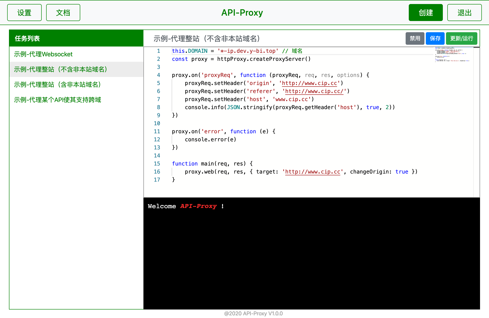

# API Proxy

API Proxy可以看作[node-http-proxy](https://github.com/http-party/node-http-proxy)的在线版。支持在线编辑API Proxy规则，一键运行。



## 运行

首先修改`user/config.json`。进入管理界面需要指定一个管理域名，可以在本地设置hosts。

### 开发环境

```bash
yarn dev
```

### 线上运行

```bash
yarn start
```

**pm2:**

```bash
NODE_ENV=production PORT=80 pm2 -i 1 start npm --name api-proxy -- start
```
